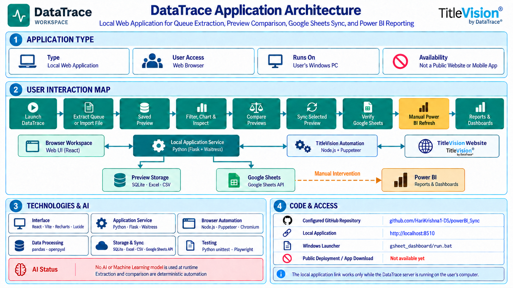

# DataTrace Application Architecture

## 1. Application Type

DataTrace Workspace is a **local web application**. The interface opens in a web
browser, while extraction, file processing, preview storage, and synchronization
run on the user's Windows computer.

| Item | Current status |
| --- | --- |
| Application type | Local web application |
| User interface | Web browser |
| Runtime location | User's Windows PC |
| Public website | Not deployed |
| Native desktop/mobile app | Not created |
| Installer or app-store download | Not available |

## 2. User Interaction Map

1. Launch DataTrace Workspace with the Windows launcher.
2. Select **Extract Queue** or import a CSV/XLSX file.
3. Extraction opens TitleVision, signs in, reads the queue, and saves a numbered preview.
4. Select a preview to search, filter, inspect columns, view charts, and download data.
5. Compare any two previews to review matched, missing, newly added, and unchanged orders.
6. Select a preview and sync it to Google Sheets manually, or enable the optional daily trigger.
7. Check and verify the synchronized Google Sheets tabs.
8. Manually refresh or import the data in Power BI.
9. Review the Power BI reports and dashboards.

## 3. Application Flow

| Layer | Responsibility |
| --- | --- |
| Browser workspace | Preview selection, filters, charts, comparisons, exports, and sync controls |
| Local application service | Coordinates extraction, imports, previews, comparisons, downloads, and sync jobs |
| TitleVision automation | Opens Chromium, signs in, refreshes the queue, follows pagination, and extracts rows |
| Data processing | Cleans queue records and produces Excel/CSV outputs and report-specific layouts |
| Preview storage | Keeps numbered Excel/CSV previews and a local SQLite history index |
| Google Sheets | Receives the selected preview in Full Report, All Products, Full Title, and Remaining Products tabs |
| Power BI | Uses manually verified sheet or Excel/CSV data for reporting |

The Google Sheets and Power BI stages are separate. DataTrace can sync a selected
preview to Google Sheets, but a user must verify the sheet and refresh or import it
in Power BI. Automatic Power BI publishing is not configured.

## 4. Technologies And AI

| Area | Technologies |
| --- | --- |
| Interface | React, Vite, Recharts, Lucide |
| Application service | Python, Flask, Waitress |
| Browser automation | Node.js, Puppeteer, Chromium |
| Data processing | pandas, openpyxl |
| Storage and exports | SQLite, Excel, CSV |
| Google integration | Google Sheets API, gspread, google-auth |
| Testing | Python unittest, Playwright |

### AI Status

No AI model, machine-learning model, LLM API, vector database, or AI inference is
used by the running application. Queue extraction and preview comparison are
deterministic automation. AI assistance used during development or for architecture
illustrations is not part of the application runtime.

## 5. Code And Access

| Item | Link or status |
| --- | --- |
| Configured GitHub repository | <https://github.com/HariKrishna1-DS/powerBI_Sync> |
| Local application | <http://localhost:8510> |
| Windows launcher | `gsheet_dashboard/run.bat` |
| Setup guide | [SYNC_SETUP.md](gsheet_dashboard/SYNC_SETUP.md) |
| Google Sheet target | <https://docs.google.com/spreadsheets/d/1xjQ3yaDpMgvp3cRSQM-SfF8UBnbTcW_HWpZp_aN5-a8/edit?gid=0> |
| Public deployment | Not configured |
| App download or installer | Not available |

The GitHub URL is the repository configured in the local Git checkout. The current
workspace contains uncommitted changes, so the local application may be newer than
the code currently available from that URL. The localhost link works only while the
DataTrace server is running on the user's computer.
