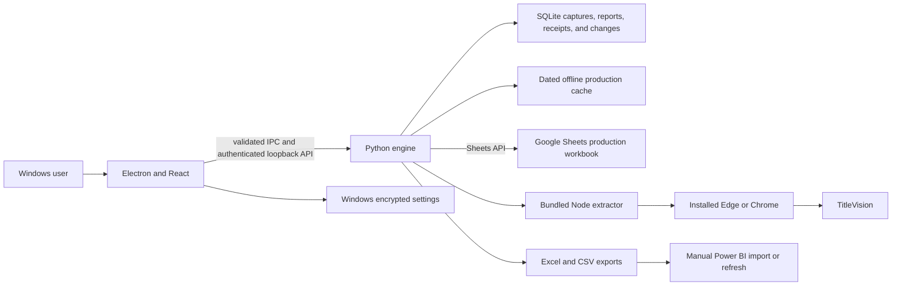

# Tv Tracker architecture

Tv Tracker is a Windows desktop application. Electron owns the window, tray, update flow, native dialogs, and encrypted per-user connections. A sandboxed React interface calls a bundled Python engine over an authenticated loopback HTTP connection. The engine runs locally; there is no required hosted application server or PostgreSQL database.

## Connection and storage

Each installation saves a spreadsheet ID, service-account JSON key, tracker tab names, and TitleVision connection through **Connections & settings**. Windows encryption protects the saved credentials for that user's profile. The service account must have Editor access to the configured spreadsheet. A connection check reads the target without writing production data.

| Store | Purpose |
| --- | --- |
| Google Sheets | Authoritative production tracker rows, monthly tracker tabs, and published report tabs |
| SQLite in the user workspace | Immutable saved queue captures, ordered sync jobs and receipts, parsed imported Excel rows and file provenance, source selection, and imported-order change history |
| Dated local JSON cache | Last successful production read when Sheets is temporarily unavailable |
| Workspace backups | Recoverable local data and report backups; credentials are excluded |

The desktop app starts the local engine on an operating-system-assigned loopback port and authenticates its requests. The optional browser launcher uses `gsheet_dashboard/start-local.bat`, normally at `http://127.0.0.1:8510`. Neither mode exposes a public web service by default.

## Queue capture and tracker sync

1. A user extracts the TitleVision queue through the bundled Node automation or imports a queue file. The engine saves a numbered capture locally before sync.
2. The sync worker processes captures in order, reconciles Order Numbers with the named Google Sheets trackers, and verifies writes. A failed capture stays local with a retry action; later captures wait behind unresolved earlier failures.
3. Tracker tabs remain the production authority. Monthly ownership, rollover, completion evidence, SLA classification, and manual field preservation follow the rules in [monthly production](docs/TV_TRACKER_MONTHLY_PRODUCTION.md) and [completion recovery](docs/TV_TRACKER_2_5_3_RELEASE.md).
4. The interface reads live Sheets data when available and labels cached production reads when offline. Saved captures remain available locally.

Power BI consumes exported or manually refreshed data. Tv Tracker does not publish to Power BI automatically.

## Imported Excel reporting

**Import Excel report** is independent of queue capture and tracker sync. Parsed XLSX/CSV rows and workbook provenance are saved in SQLite, and the latest uploaded occurrence of a repeated Order Number wins. The selected report source controls the dashboard and report APIs. Publishing writes seven public report tabs, including **All Products**, the product detail tabs, **Daily Status Report**, **Monthly Orders**, **PR Excel**, and **Status Report**; tracker and history tabs stay hidden for recovery.

Daily received dates use **In-Time** (or Date when In-Time is absent). A row with status **Completed and Delivered** moves to the **Out Time** month when that valid completion month is later than its arrival month. A completed row without Out Time remains in its arrival month and appears in that month's completed orders. This month attribution applies to imported report summaries; it does not rewrite the original workbook values or the production tracker month.

When a Daily Orders date is selected, the app queues a Sheets update that highlights the date in **Daily Status Report** and applies a basic filter to **All Products** for that received day. Selecting a different date replaces that basic filter. It is a shared spreadsheet filter, so collaborators looking at All Products see the latest selected date. The current filter uses the displayed In-Time/Date values; the local Daily Orders tables continue to use their own selected date and status groups.

Report publication happens after the imported source is saved locally. If Sheets rejects or cannot complete a publication, the source stays local and the user can retry without uploading it again. Imported edits made directly in the published Sheets tabs are reconciled into local change history before republication, with conflicting edits surfaced for review.

## Interface and release flow

The React workspace includes Overview, Data Sheets, Daily Orders, Monthly Orders, Capacity Report, Changes, Captures, Import Excel Changes, and Activity. Daily metric cards jump to their matching order tables. Chart filters, status breakdown, and the custom chart start open; users can collapse them.

The desktop release branch is `tv-tracker-app`. `desktop/build.ps1` bundles the Python engine, Node extractor, and React frontend into an installer and portable ZIP. The GitHub Actions workflow validates the build and, for a new version, stages the installer, update manifest, source ZIP, and checksums before publication. The installed app checks published GitHub releases and installs only after the user chooses **Download** and **Install & open**. See [desktop updates](docs/DESKTOP_UPDATES.md) for release and signing requirements.
