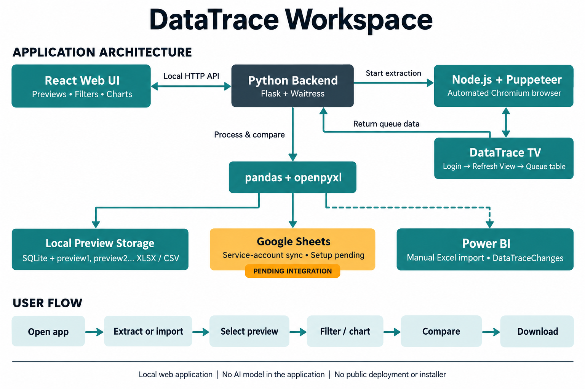

# DataTrace Workspace: Project Architecture

## 1. Application Architecture

The React frontend runs in a browser and calls a local Python HTTP API. The API
starts extraction jobs in a background thread. Node.js and Puppeteer launch
Chromium, log in to DataTrace TV, refresh the results panel, and extract queue
rows. Python processes the results and saves each successful capture as a new
numbered preview before attempting Google Sheets sync.

| Layer | Implementation | Responsibility |
| --- | --- | --- |
| User interface | React, Vite, Recharts, Lucide | Preview selection, filters, charts, comparison, downloads |
| Local API | Python, Flask, Waitress | Extraction jobs, file import, preview access, comparison, downloads |
| Browser automation | Node.js, Puppeteer, Chromium | Login, Refresh View, queue extraction and pagination |
| Processing | pandas, openpyxl | Calculated fields, CSV/Excel exports and named Excel tables |
| Local persistence | SQLite and local files | Capture history and preview1.xlsx/csv, preview2.xlsx/csv, etc. |
| Google Sheets integration | gspread, google-auth, Sheets API | Replace the configured worksheet using service-account access |
| Power BI handoff | Excel/CSV downloads | Manual import of DataTraceQueue or DataTraceChanges into Power BI |

Source modules: `gsheet_dashboard/frontend/src/main.jsx`, `server.py`,
`scrape_datatrace.js`, `datatrace_sync.py`, `preview_store.py`, `sync_config.py`.

Google Sheets sync is configured but still requires a valid service-account key
and Editor access. A Sheets failure does not remove a saved local preview.
Power BI is an export destination; no embedded Power BI report or automatic
Power BI Service publishing is currently configured.

## 2. Application Type

**Local web application with browser automation.** It opens in a web browser,
while its Python server, Chromium automation and storage run on the user's PC.
The project is not currently a hosted public website, native mobile application,
packaged desktop installer or AI-powered application.

## 3. User Interaction Map

1. Launch the local server and open DataTrace Workspace.
2. Click Run AutoLogin & Extract Queue, or import an existing CSV/XLSX file.
3. Select a saved numbered preview.
4. Click a column header to inspect unique values/counts and apply filters.
5. Choose chart type and grouping, then scroll or adjust the chart range.
6. Open Changes and compare the selected preview with an earlier one.
7. Download the preview, filtered CSV, unique values, or Power BI changes workbook.
8. Run extraction again to create the next numbered preview.

Extraction additionally attempts Google Sheets sync. File imports create local
previews without logging into DataTrace or updating Google Sheets. Extraction is
button/CLI-triggered; no recurring scheduler is installed.

## 4. Technologies and AI

The active stack is React/JavaScript, Vite, Recharts, Lucide, Python, Flask,
Waitress, Node.js, Puppeteer, Chromium, pandas, openpyxl, SQLite, gspread,
google-auth and python-dotenv. Tests use Python unittest and Playwright.

**No AI/ML model, LLM API, vector database or AI inference is used by the app.**
Extraction is deterministic browser automation; comparisons match task keys or
compare row multisets. AI assistance used during development or to illustrate
this architecture is separate from the application's runtime technology.
Streamlit/Plotly packages remain in the dependency file from the former UI;
the current interface is React.

## 5. Code and Access Links

| Item | Link / status |
| --- | --- |
| Configured GitHub repository | https://github.com/HariKrishna1-DS/powerBI_Sync |
| Local running app | http://localhost:8510/ |
| Windows launcher | `gsheet_dashboard/run.bat` |
| Setup instructions | [SYNC_SETUP.md](gsheet_dashboard/SYNC_SETUP.md) |
| Google Sheet target | https://docs.google.com/spreadsheets/d/1xjQ3yaDpMgvp3cRSQM-SfF8UBnbTcW_HWpZp_aN5-a8/edit?gid=0 |
| Public deployment | None configured |
| Installer / app-store download | None created |

The GitHub URL is the repository's configured origin. Current implementation
changes are present locally and include uncommitted/untracked files; this
document does not assert that those changes are already published to GitHub.
The localhost link works on the machine running the server, not as a public URL.

## Architecture Image

The accompanying diagram is an AI-generated illustration using the built-in
image-generation tool, not a screenshot of the application.
Prompt specification: create a simple white-background DataTrace Workspace
architecture diagram showing React communicating with Flask/Waitress, Python
starting Node.js/Puppeteer to extract DataTrace TV, pandas/openpyxl processing
results, SQLite/numbered local Excel/CSV previews, pending service-account
Google Sheets sync, and a dashed manual Excel import route to Power BI. Include
the user flow Open app > Extract or import > Select preview > Filter/chart >
Compare > Download. Label it a local web application with no AI model, public
deployment or installer. Exclude credentials and invented services.
